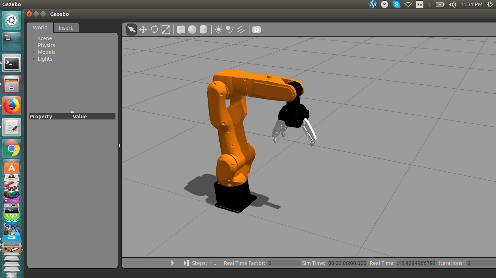

### Fanuc LR mate 200ic Industrial Robotic Arm 
MD Muhaimin Rahman
contact: sezan92[at]gmail[dot]com

#### Introduction
In this project, I have developed a ```Gazebo``` Model for Fanuc LR mate 200ic Industrial Robot. I have added ```Robotiq``` gripper with the model. The ```urdf``` folder has ```Fanuc.urdf.xacro``` file which describes the whole model. The ```meshes``` folder has the mesh files which are converted from preexisting Solidworks cad models. The ```config``` folder has ```fanuc_control.yaml``` file which describes the joint controllers. The video is available [here](https://youtu.be/ieMNhy4OPx8) .

#### Prerequisites
```sudo apt-get install ros-indigo-rqt-common-plugins```
```sudo apt-get install ros-indigo-rqt-ez-publisher```
#### How to run
*  Place the folder in the ```src``` folder of catkin workspace
* cd to catkin workspace
* run ```catkin_make```
* Running simulation
```roslaunch Fanuc main.launch```	
* In the ``` rqt gui ```, Please choose the following topics to run the robot model
```/fanuc/fanuc/Base_Part2_controller/command```
```/fanuc/fanuc/Part2_Part3_controller/command```
```/fanuc/fanuc/Part3_Part4_controller/command```
```/fanuc/fanuc/Part4_Part5_controller/command```
```/fanuc/fanuc/Part6_Gripper_Base_controller/command```

#### Further Development
For further development , please read the [Development](Development.md) file.
